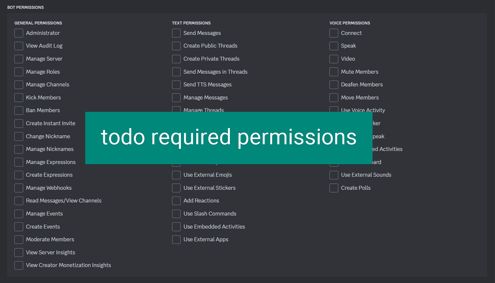

# Bot

- [Bot](#bot)
  - [Setup](#setup)
    - [Create Discord Bot](#create-discord-bot)
    - [Start](#start)

## Setup

### Create Discord Bot

1. Create bot: https://discord.com/developers/applications
2. Copy token (`Bot > Token`) and save in `.env`
   1. `DISCORD_TOKEN=your_token_here`
3. Invite to server `OAuth2 > OAuth2 URL Generator`
   1. Select `bot` and the following permissions:
   2. 
4. Enable message content intent
   1. `Bot > Privileged Gateway Intents > Message Content Intent`
5. Open link and add bot to server
6. See [Start](#start)

### Start

```bash
python src/bot.py
```
